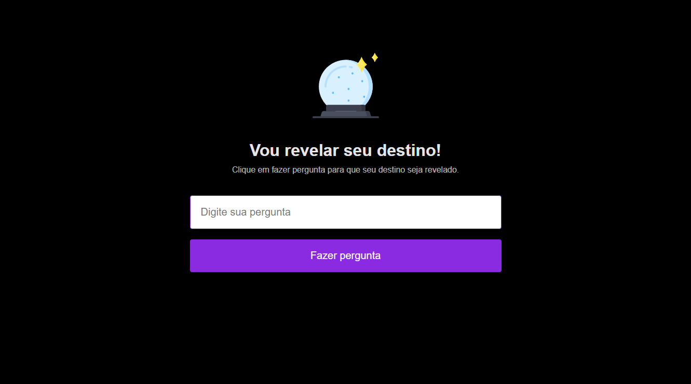

# :satellite: Maratona Explorer

<div align="center" id="top"> 
  

&#xa0;

</div>

<hr>

<p align="center">
  <a href="#dart-sobre">Sobre</a> &#xa0; | &#xa0; 
  <a href="#white_check_mark-requisitos">Requisitos</a> &#xa0; | &#xa0;
  <a href="#checkered_flag-rodar">Rodar</a> &#xa0; | &#xa0;
  <a href="#memo-license">License</a> &#xa0; | &#xa0;
  <a href="https://github.com/linderjunior" target="_blank">Autor</a>
</p>

<br>

## :dart: Sobre

Descubra o que o destino tem para revelar 💻📱🚀

## :white_check_mark: Requisitos

Antes de rodar a app :checkered_flag:, é necessário ter [Git](https://git-scm.com) e [VSCode](https://code.visualstudio.com) instalados.

## :checkered_flag: Rodar

```bash
# Clone este projeto
$ git clone https://github.com/LinderJunior/maratona-explorer.git

# Acesse a pasta
$ cd maratona-explorer/
```

## :memo: License

This project is under license from MIT. For more details, see the [LICENSE](LICENSE.md) file.

Feito com :heart: por <a href="https://github.com/jose-bone" target="_blank">Linder Jr durante a maratona explorer oferecida pela #Rocketseat</a>

&#xa0;

<a href="#top">Back to top</a>
